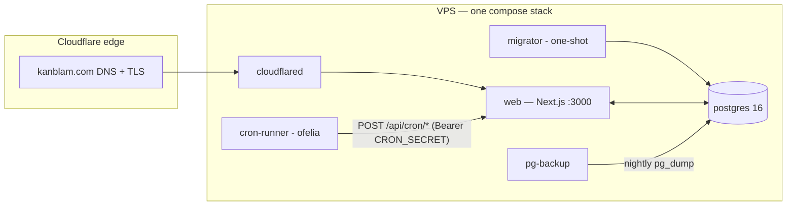
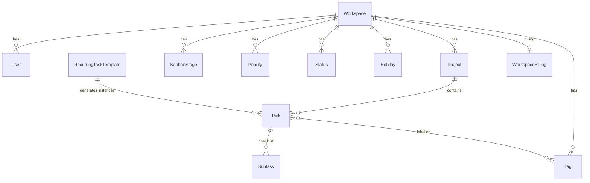

# Architecture

How KanBlam is built, why it's built that way, and where to look when you
want to change something. Companion to
[`CONFIGURATION.md`](./CONFIGURATION.md) (every env var) and the
[deployment runbook](./runbooks/deployment.md).

## Design philosophy

Three decisions shape everything else:

1. **Single box.** One VPS runs the whole product: app, database, cron,
   backups, tunnel. No managed services, no queues, no per-user compute.
   Postgres does double duty as the realtime bus. This keeps self-hosting a
   one-command affair and keeps the hosted service cheap to run.
2. **One image, many deployments.** All configuration is read from
   `process.env` at request time — nothing environment-specific is baked in
   at build. The exact same Docker image serves kanblam.com, a self-host
   install, and the try.kanblam.com demo box; env vars alone decide the
   behaviour (see CONFIGURATION.md).
3. **Boring, current tech.** Next.js App Router + Postgres + Prisma, no
   exotic infrastructure. The product should be maintainable by one person
   on a weekend.

## Stack

| Layer | Choice |
|---|---|
| Framework | Next.js 15 (App Router, standalone output), React 19 |
| Language | TypeScript, strict |
| Database | PostgreSQL 16, Prisma ORM |
| Auth | Auth.js v5, credentials provider (email + bcrypt password), JWT sessions |
| Styling | Tailwind v4 over a token layer ("Soft Slate", light + dark) |
| Drag & drop | `@dnd-kit` — every DnD surface is also keyboard-operable with screen-reader announcements |
| Docs site | Nextra v4 (MDX pages under `app/docs/`) |
| Email | SMTP (MailHog in dev, any relay in prod) |
| Runtime | Docker Compose on a single VPS, Cloudflare Tunnel ingress (no open inbound ports) |

## Runtime topology



- **web** — the Next.js standalone server. The only thing that talks HTTP.
- **migrator** — runs `prisma migrate deploy && prisma db seed` on every
  deploy, then exits. Schema changes ship as committed Prisma migrations;
  the seed is idempotent (bails if a workspace exists).
- **cron-runner** — [ofelia](https://github.com/mcuadros/ofelia) reads job
  labels off the web service and POSTs to `/api/cron/*` endpoints. No cron
  logic lives outside the app itself.
- **pg-backup** — nightly `pg_dump` to a host path, with retention pruning
  and an optional healthchecks.io dead-man ping.
- **cloudflared** (compose profile `tunnel`) — outbound-only tunnel to
  Cloudflare; the VPS exposes no inbound ports at all.

The **instant demo** (try.kanblam.com) is a second copy of this exact stack
on the same VPS — own env file, own Postgres volume, own tunnel, compose
project `kanblam-demo`. Nothing is shared with production. See
`runbooks/demo-deployment.md`.

## Repository layout

```
app/
  (app)/        authenticated product — one folder per view (dashboard,
                kanban, calendar, eisenhower, tasks, projects, tags, settings)
  (auth)/       login + invite-signup
  api/          REST endpoints (tasks, projects, tags, subtasks, recurring,
                holidays, invites, settings, billing, demo, cron/*)
  docs/         public docs site (Nextra MDX)
  page.tsx      / — marketing landing or /login redirect (LANDING_MODE)
components/     React by domain; `ui/` is the shadcn-style primitive kit
lib/            domain logic: <domain>/service.ts + validators/ (zod)
prisma/         schema, migrations, first-run seed
docker/         compose files (dev + prod), pg-backup image
scripts/        operational scripts (workspace provisioning, demo tooling)
docs/           this file, CONFIGURATION.md, runbooks/
```

## Multi-tenancy & auth

A **Workspace** is the tenant. Every domain row (project, task, tag, …)
carries a `workspaceId`, and **every query filters by it** — tenancy is
enforced in the service layer on each call, not by connection-level tricks.

- Users belong to exactly one workspace and have a role: `ADMIN` (settings,
  team, imports) or `MEMBER`.
- Sign-in is Auth.js credentials → bcrypt check → JWT session carrying
  `userId`, `workspaceId`, `role`.
- There is deliberately **no middleware**; guarding lives where the data is:
  - Pages: the `(app)/layout.tsx` calls `auth()` and redirects to `/login`.
  - APIs: `requireWorkspaceContext()` / `requireWritableWorkspace()`
    (`lib/auth/workspace-scope.ts`) resolve the session and scope every
    handler. "Writable" additionally enforces billing read-only state.
- New users arrive via **email invites** (one-time token, 7-day expiry) —
  there is no open signup.

## Data model (the short version)



Points worth knowing:

- **Reference data is per-workspace rows, not enums.** Stages (Ideas → In
  Progress → On Hold → Completed → Cancelled), priorities and project
  statuses are seeded at workspace creation (`prisma/seedWorkspace.ts`), so
  they can become user-editable later without a schema change.
- **Two independent axes per task:** `kanbanStageId` (workflow position)
  and the `isImportant`/`isUrgent` flags (Eisenhower quadrant). Moving a
  card on one view never touches the other axis.
- **Progress** derives from subtask completion until the user drags the
  slider (`progressManual`) — then manual wins.
- **Deletes cascade from Workspace** through everything, which is what
  makes demo-tenant reaping a single `deleteMany`.

## Request flow

**Reads** are React Server Components: each page queries Prisma directly
(via the service layer) and renders on the server. No client-side data
fetching for initial paint.

**Writes** go through REST route handlers under `app/api/`:

```
zod validator (lib/validators/*) → service function (lib/<domain>/service.ts)
  → Prisma → notifyWorkspace(workspaceId, kind)
```

Services own tenancy checks and cross-entity invariants (e.g. "tags must
belong to this workspace", "recompute parent progress when a subtask
flips"). Route handlers stay thin: parse, delegate, map errors.

## Realtime

Postgres is the message bus — no Redis, no websocket server:

1. After a successful mutation, `notifyWorkspace()` issues a Postgres
   `NOTIFY` on a shared channel with `{workspaceId, kind}`.
2. `GET /api/realtime` holds an SSE stream per browser tab; a `LISTEN`
   connection fans messages out to streams subscribed to that workspace.
3. The client (`RealtimeSync`) wraps the app in a context; views subscribe
   to the kinds they care about and call `router.refresh()` — re-running
   the server components with fresh data. `EventSource` auto-reconnects.

Consequence: other tabs/users converge within a second, with zero client
cache to invalidate — the server render is the cache.

(Deployment note: SSE through Cloudflare Tunnel requires HTTP/2 transport —
QUIC buffers long-lived streams. Set in compose; discovered the hard way.)

## Public API (/api/v1)

A versioned, token-authenticated REST surface over the same service layer
the app uses (tasks, subtasks, comments, projects, tags, reference data).

- **Auth:** personal access tokens (Settings → API tokens), stored as
  SHA-256 hashes, sent as `Authorization: Bearer kb_…`. A token acts as
  its user (same workspace/role, limited by `read`/`write` scopes).
  `/api/v1` is Bearer-only — session cookies are deliberately rejected,
  keeping the public surface CSRF-free. Resolver: `lib/api/auth.ts`;
  every endpoint wraps in `apiHandler` (`lib/api/handler.ts`).
- **Contract:** fixed error envelope (`lib/api/errors.ts`), serializers
  pin response shapes (`lib/api/serialize.ts`), cross-workspace ids 404
  indistinguishably from unknown ones, cursor pagination on listings.
- **Rate limit:** in-memory sliding window per token (single-box rule),
  default 120/min, `Retry-After` on 429.
- **Spec:** `lib/api/openapi.ts` builds OpenAPI 3.1 **from the same zod
  validators the routes parse with**; `scripts/generate-openapi.ts`
  writes `public/openapi.json` and CI fails on drift. Human rendering at
  `/docs/api`; quickstart at `/docs/api-quickstart`.
- **Mutations emit the app's realtime notifies**, so open boards follow
  API-driven changes live. `scripts/agent-smoke.mjs` exercises the whole
  loop the way an Agent Member will.

## Recurring tasks

Template-and-instance model:

- A `RecurringTaskTemplate` holds the blueprint (fields, tags, subtask
  templates) + the rule (`DAILY`/`WEEKLY`/`MONTHLY`, interval, weekdays,
  start/end).
- The `generate-recurring-tasks` cron (every 5 min) materialises concrete
  Task rows from a high-water mark (`lastGeneratedDate`) up to a rolling
  window, so instances appear on boards/calendar like normal tasks.
- Editing/deleting an instance prompts for scope: **this** / **this and
  following** (splits the series) / **all**. Template-defining fields
  propagate; work-state fields (stage, progress, subtask completion) stay
  per-instance.

## Background jobs

All jobs are app endpoints under `/api/cron/*`, authenticated with
`Bearer CRON_SECRET`, triggered by ofelia labels on the web service:

| Job | Cadence | Does |
|---|---|---|
| `generate-recurring-tasks` | 5 min | Materialise recurring instances per workspace |
| `reconcile-billing` | hourly | Polar drift reconciliation (no-op unless billing enabled) |
| `cleanup-demo-workspaces` | nightly | Reap expired demo tenants (no-op unless `DEMO_MODE=1`) |

Jobs are safe to ship in the shared compose file because each one no-ops on
deployments where its feature is off.

## Deployment modes & feature flags

One codebase, three flavours, selected purely by env
(see CONFIGURATION.md for the full reference):

- **Hosted SaaS** — marketing landing + waitlist, `DEMO_URL` renders demo
  links, billing infrastructure present (test mode until go-live).
- **Self-host** — `LANDING_MODE=app`, no waitlist, no analytics, no
  billing. AGPL: every feature free, no gating.
- **Instant demo** — `DEMO_MODE=1`: `/demo` provisions a throwaway petname
  tenant server-side, seeds the Stratos-1 dataset (`lib/demo/`), signs the
  visitor in, and a nightly cron deletes tenants older than
  `DEMO_TTL_HOURS`. Rate-limited in-memory (fits the single-box rule).

**Billing** (hosted only) is a Polar.sh integration: checkout + webhook
sync into `WorkspaceBilling`, with enforcement expressed as an access level
(`full` → `read_only`) that `requireWritableWorkspace()` checks. Fail-safe
design: missing token/products = billing hard-off.

**Analytics** run on public routes only (landing, docs, login) with
server-injected PostHog keys; the authenticated app is never instrumented.

## Frontend conventions

- Server components by default; client components (`"use client"`) only for
  interactivity islands — boards, forms, dialogs, the quick-add palette.
- Shared UI primitives in `components/ui/` (shadcn-style); domain components
  grouped per feature folder.
- Quick Add (`⌘K`) parses inline tokens (`[CODE] #tag !high !important
  due:fri`) client-side against workspace data provided by the app layout.
- All five drag-and-drop surfaces (kanban, eisenhower, calendar, subtasks,
  swim lanes) run on `@dnd-kit` with keyboard sensors and `aria-live`
  announcements — accessibility is a feature, not a retrofit.
- Theme tokens (light/dark) live in `globals.css`; components consume
  semantic tokens (`bg-background`, `text-muted-foreground`), never raw
  colours.

## Docs site

`/docs` is Nextra v4 MDX rendered inside the app (same deployment, no
separate site). Screenshots ship in `public/images/docs/` and come from the
demo seed dataset — one refresh updates docs and marketing together
(`scripts/demo/`). Dev gotcha: Turbopack needs the
`next-mdx-import-source-file` alias in `next.config.ts`; see the comment
there before touching it.
